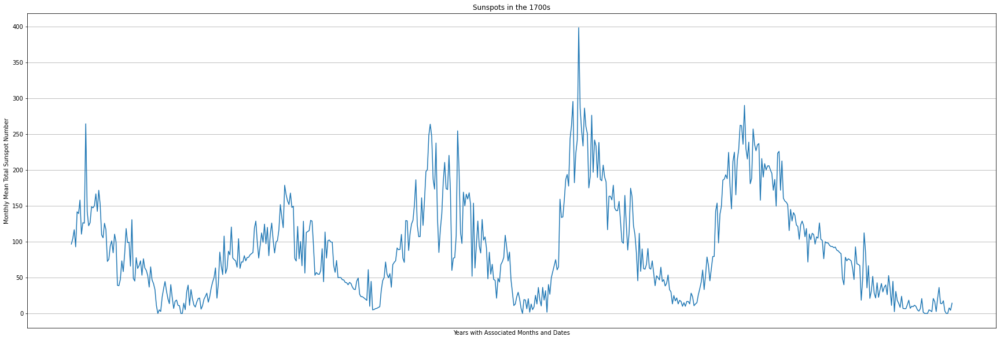
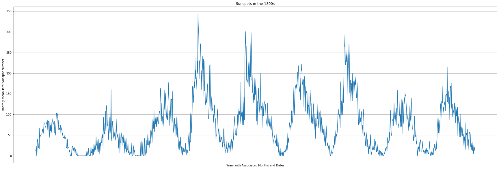
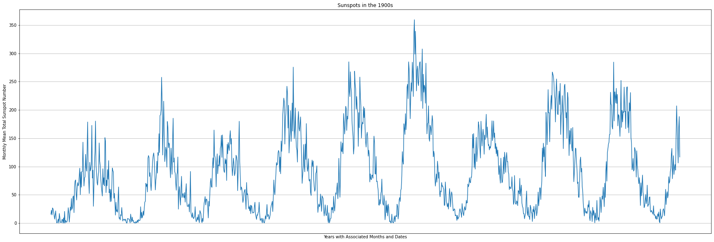
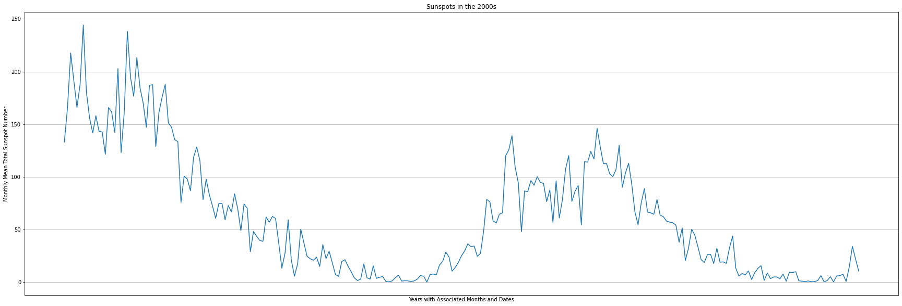

```python
from google.colab import drive
drive.mount('/content/drive')
```

    Mounted at /content/drive


```python
import pandas as pd
from numpy import datetime64
import matplotlib.pyplot as plotter


class DataProcessing:
    def __init__(self, var1, var2):
        self.a = var1
        self.b = var2

    def lstprocessing(self):
        yrs = []
        joint = list(map(lambda x, y: [x, float(y)], self.a.iloc[:, 0], self.a.iloc[:, 1]))
        for op in joint:
            if op[0].startswith(self.b[:2]):
                yrs.append(op)
        return yrs

    def plotter(self):
        fig, ax = plotter.subplots(figsize=(30, 10))
        ax.plot(*zip(*DataProcessing.lstprocessing(self)))
        ax.set_xlabel('Years with Associated Months and Dates')
        ax.set_ylabel('Monthly Mean Total Sunspot Number')
        ax.set_title('Sunspots in the %s' % (self.b[:2]+'00s'))
        ax.set_xticks([])
        ax.grid(True)
        plotter.show()

    def statisticalprocessing(self):
        yrs, mmtsn = zip(*DataProcessing.lstprocessing(self))
        yrs = [datetime64(i) for i in yrs]
        yrs_series = pd.Series(yrs)
        mmtsn_series = pd.Series(mmtsn)
        print('A statistical analysis on the years: ')
        print(yrs_series.describe())
        print('A statistical analysis on the Monthly Mean Total Sunspot Number: ')
        print(mmtsn_series.describe())


data = pd.read_csv('/content/drive/MyDrive/Sunspots/Sunspots.csv', usecols=[1, 2])
years = ['1700', '1800', '1900', '2000']
for i in years:
    yrsutl = DataProcessing(data, i)
    yrsutl.plotter()
    yrsutl.statisticalprocessing()

```





    A statistical analysis on the years: 
    count                     612
    unique                    612
    top       1799-09-30 00:00:00
    freq                        1
    first     1749-01-31 00:00:00
    last      1799-12-31 00:00:00
    dtype: object
    A statistical analysis on the Monthly Mean Total Sunspot Number: 
    count    612.000000
    mean      90.815850
    std       68.994009
    min        0.000000
    25%       35.600000
    50%       77.100000
    75%      128.850000
    max      398.200000
    dtype: float64


    /usr/local/lib/python3.7/dist-packages/ipykernel_launcher.py:35: FutureWarning: Treating datetime data as categorical rather than numeric in `.describe` is deprecated and will be removed in a future version of pandas. Specify `datetime_is_numeric=True` to silence this warning and adopt the future behavior now.





    A statistical analysis on the years: 
    count                    1200
    unique                   1200
    top       1867-06-30 00:00:00
    freq                        1
    first     1800-01-31 00:00:00
    last      1899-12-31 00:00:00
    dtype: object
    A statistical analysis on the Monthly Mean Total Sunspot Number: 
    count    1200.000000
    mean       73.022667
    std        62.103360
    min         0.000000
    25%        21.100000
    50%        60.650000
    75%       107.700000
    max       343.800000
    dtype: float64


    /usr/local/lib/python3.7/dist-packages/ipykernel_launcher.py:35: FutureWarning: Treating datetime data as categorical rather than numeric in `.describe` is deprecated and will be removed in a future version of pandas. Specify `datetime_is_numeric=True` to silence this warning and adopt the future behavior now.





    A statistical analysis on the years: 
    count                    1200
    unique                   1200
    top       1955-02-28 00:00:00
    freq                        1
    first     1900-01-31 00:00:00
    last      1999-12-31 00:00:00
    dtype: object
    A statistical analysis on the Monthly Mean Total Sunspot Number: 
    count    1200.000000
    mean       90.039417
    std        72.739562
    min         0.000000
    25%        27.900000
    50%        74.200000
    75%       137.450000
    max       359.400000
    dtype: float64


    /usr/local/lib/python3.7/dist-packages/ipykernel_launcher.py:35: FutureWarning: Treating datetime data as categorical rather than numeric in `.describe` is deprecated and will be removed in a future version of pandas. Specify `datetime_is_numeric=True` to silence this warning and adopt the future behavior now.





    A statistical analysis on the years: 
    count                     253
    unique                    253
    top       2017-11-30 00:00:00
    freq                        1
    first     2000-01-31 00:00:00
    last      2021-01-31 00:00:00
    dtype: object
    A statistical analysis on the Monthly Mean Total Sunspot Number: 
    count    253.000000
    mean      62.268379
    std       57.964333
    min        0.000000
    25%       10.700000
    50%       48.800000
    75%       97.800000
    max      244.300000
    dtype: float64


    /usr/local/lib/python3.7/dist-packages/ipykernel_launcher.py:35: FutureWarning: Treating datetime data as categorical rather than numeric in `.describe` is deprecated and will be removed in a future version of pandas. Specify `datetime_is_numeric=True` to silence this warning and adopt the future behavior now.


```python
!jupyter nbconvert "/content/drive/MyDrive/Colab Notebooks/SunSpots.ipynb --to markdown  --output-dir markdown
```

    [NbConvertApp] WARNING | pattern '/content/drive/MyDrive/Colab' matched no files
    [NbConvertApp] WARNING | pattern 'Notebooks/SunSpots.ipynb' matched no files
    This application is used to convert notebook files (*.ipynb)
            to various other formats.
    
            WARNING: THE COMMANDLINE INTERFACE MAY CHANGE IN FUTURE RELEASES.
    
    Options
    =======
    The options below are convenience aliases to configurable class-options,
    as listed in the "Equivalent to" description-line of the aliases.
    To see all configurable class-options for some <cmd>, use:
        <cmd> --help-all
    
    --debug
        set log level to logging.DEBUG (maximize logging output)
        Equivalent to: [--Application.log_level=10]
    --show-config
        Show the application's configuration (human-readable format)
        Equivalent to: [--Application.show_config=True]
    --show-config-json
        Show the application's configuration (json format)
        Equivalent to: [--Application.show_config_json=True]
    --generate-config
        generate default config file
        Equivalent to: [--JupyterApp.generate_config=True]
    -y
        Answer yes to any questions instead of prompting.
        Equivalent to: [--JupyterApp.answer_yes=True]
    --execute
        Execute the notebook prior to export.
        Equivalent to: [--ExecutePreprocessor.enabled=True]
    --allow-errors
        Continue notebook execution even if one of the cells throws an error and include the error message in the cell output (the default behaviour is to abort conversion). This flag is only relevant if '--execute' was specified, too.
        Equivalent to: [--ExecutePreprocessor.allow_errors=True]
    --stdin
        read a single notebook file from stdin. Write the resulting notebook with default basename 'notebook.*'
        Equivalent to: [--NbConvertApp.from_stdin=True]
    --stdout
        Write notebook output to stdout instead of files.
        Equivalent to: [--NbConvertApp.writer_class=StdoutWriter]
    --inplace
        Run nbconvert in place, overwriting the existing notebook (only 
                relevant when converting to notebook format)
        Equivalent to: [--NbConvertApp.use_output_suffix=False --NbConvertApp.export_format=notebook --FilesWriter.build_directory=]
    --clear-output
        Clear output of current file and save in place, 
                overwriting the existing notebook.
        Equivalent to: [--NbConvertApp.use_output_suffix=False --NbConvertApp.export_format=notebook --FilesWriter.build_directory= --ClearOutputPreprocessor.enabled=True]
    --no-prompt
        Exclude input and output prompts from converted document.
        Equivalent to: [--TemplateExporter.exclude_input_prompt=True --TemplateExporter.exclude_output_prompt=True]
    --no-input
        Exclude input cells and output prompts from converted document. 
                This mode is ideal for generating code-free reports.
        Equivalent to: [--TemplateExporter.exclude_output_prompt=True --TemplateExporter.exclude_input=True]
    --log-level=<Enum>
        Set the log level by value or name.
        Choices: any of [0, 10, 20, 30, 40, 50, 'DEBUG', 'INFO', 'WARN', 'ERROR', 'CRITICAL']
        Default: 30
        Equivalent to: [--Application.log_level]
    --config=<Unicode>
        Full path of a config file.
        Default: ''
        Equivalent to: [--JupyterApp.config_file]
    --to=<Unicode>
        The export format to be used, either one of the built-in formats
                ['asciidoc', 'custom', 'html', 'latex', 'markdown', 'notebook', 'pdf', 'python', 'rst', 'script', 'slides']
                or a dotted object name that represents the import path for an
                `Exporter` class
        Default: 'html'
        Equivalent to: [--NbConvertApp.export_format]
    --template=<Unicode>
        Name of the template file to use
        Default: ''
        Equivalent to: [--TemplateExporter.template_file]
    --writer=<DottedObjectName>
        Writer class used to write the 
                                            results of the conversion
        Default: 'FilesWriter'
        Equivalent to: [--NbConvertApp.writer_class]
    --post=<DottedOrNone>
        PostProcessor class used to write the
                                            results of the conversion
        Default: ''
        Equivalent to: [--NbConvertApp.postprocessor_class]
    --output=<Unicode>
        overwrite base name use for output files.
                    can only be used when converting one notebook at a time.
        Default: ''
        Equivalent to: [--NbConvertApp.output_base]
    --output-dir=<Unicode>
        Directory to write output(s) to. Defaults
                                      to output to the directory of each notebook. To recover
                                      previous default behaviour (outputting to the current 
                                      working directory) use . as the flag value.
        Default: ''
        Equivalent to: [--FilesWriter.build_directory]
    --reveal-prefix=<Unicode>
        The URL prefix for reveal.js (version 3.x).
                This defaults to the reveal CDN, but can be any url pointing to a copy 
                of reveal.js. 
                For speaker notes to work, this must be a relative path to a local 
                copy of reveal.js: e.g., "reveal.js".
                If a relative path is given, it must be a subdirectory of the
                current directory (from which the server is run).
                See the usage documentation
                (https://nbconvert.readthedocs.io/en/latest/usage.html#reveal-js-html-slideshow)
                for more details.
        Default: ''
        Equivalent to: [--SlidesExporter.reveal_url_prefix]
    --nbformat=<Enum>
        The nbformat version to write.
                Use this to downgrade notebooks.
        Choices: any of [1, 2, 3, 4]
        Default: 4
        Equivalent to: [--NotebookExporter.nbformat_version]
    
    Examples
    --------
    
        The simplest way to use nbconvert is
    
                > jupyter nbconvert mynotebook.ipynb
    
                which will convert mynotebook.ipynb to the default format (probably HTML).
    
                You can specify the export format with `--to`.
                Options include ['asciidoc', 'custom', 'html', 'latex', 'markdown', 'notebook', 'pdf', 'python', 'rst', 'script', 'slides'].
    
                > jupyter nbconvert --to latex mynotebook.ipynb
    
                Both HTML and LaTeX support multiple output templates. LaTeX includes
                'base', 'article' and 'report'.  HTML includes 'basic' and 'full'. You
                can specify the flavor of the format used.
    
                > jupyter nbconvert --to html --template basic mynotebook.ipynb
    
                You can also pipe the output to stdout, rather than a file
    
                > jupyter nbconvert mynotebook.ipynb --stdout
    
                PDF is generated via latex
    
                > jupyter nbconvert mynotebook.ipynb --to pdf
    
                You can get (and serve) a Reveal.js-powered slideshow
    
                > jupyter nbconvert myslides.ipynb --to slides --post serve
    
                Multiple notebooks can be given at the command line in a couple of 
                different ways:
    
                > jupyter nbconvert notebook*.ipynb
                > jupyter nbconvert notebook1.ipynb notebook2.ipynb
    
                or you can specify the notebooks list in a config file, containing::
    
                    c.NbConvertApp.notebooks = ["my_notebook.ipynb"]
    
                > jupyter nbconvert --config mycfg.py
    
    To see all available configurables, use `--help-all`.
    


```python

```
